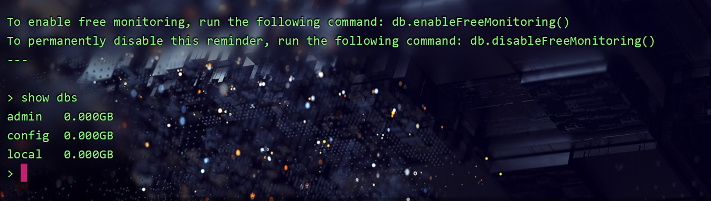
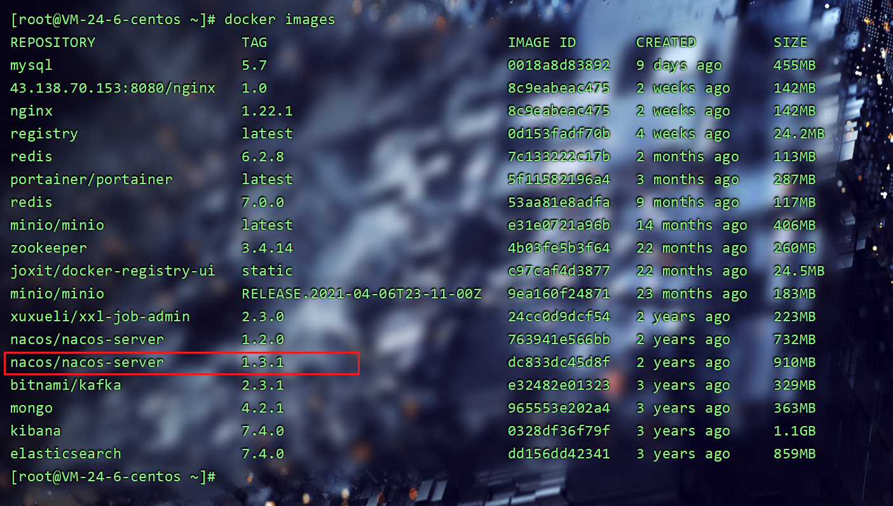

### 1、MongoDB

> MongoDB安装并设置密码：https://www.runoob.com/docker/docker-install-mongodb.html

```
# 拉取镜像
docker pull mongo:4.2.1

# 启动参数
docker run -di --name mongo-service --restart=always -p 27017:27017 -v /docker/mongodb/data:/data mongo:4.2.1

# 进入容器
docker exec -it mongo-service /bin/bash

# 进入mongo客户端
mongo
# 或者 mongo --host=127.0.0.1 --port=27017
```

- `-v /docker/mongodb/data:/data` 挂载数据卷
- `--restart=always` 开机自启
- `-p` 端口映射， mongodb端口号27017




### 2、Redis(单机版)

> 2.1、Redis最简单安装方式

```
# 下载镜像
docker pull redis:7.0.0

# 运行参数
docker run --name redis -p 6379:6379 -d redis:7.0.0 redis-server --appendonly yes --requirepass "admin123"

# 进入容器
docker exec -it redis /bin/bash
```
- --appendonly yes 开启AOF持久化
- --requirepass 用户密码
- -p端口映射， redis端口6379


> 2.2、Resdis更完整安装方式

（1）下载镜像

```
docker pull redis:6.2.8
```

（2）创建redis宿主目录和配置文件，留着后面挂载文件用

```
mkdir -p /docker/redis/conf
cd /docker/redis/conf
vi redis.conf
```

redis.conf:

```
# 关闭安全模式
protected-mode no

#redis端口号
port 6379

# 注掉bind
# bind 127.0.0.1

tcp-backlog 511

#redis密码设置
requirepass admin123     

timeout 0

tcp-keepalive 300

# 关闭守护进程,让redis后台运行
daemonize no

supervised no

pidfile /var/run/redis_6379.pid

loglevel notice

logfile ""

# 设置数据库的数量
databases 15

always-show-logo yes

save 900 1
save 300 10
save 60 10000

stop-writes-on-bgsave-error yes

rdbcompression yes

rdbchecksum yes

dbfilename dump.rdb

dir ./

replica-serve-stale-data yes

replica-read-only yes

repl-diskless-sync no

repl-disable-tcp-nodelay no

replica-priority 100

lazyfree-lazy-eviction no
lazyfree-lazy-expire no
lazyfree-lazy-server-del no
replica-lazy-flush no

appendonly yes

appendfilename "appendonly.aof"

no-appendfsync-on-rewrite no

auto-aof-rewrite-percentage 100
auto-aof-rewrite-min-size 64mb

aof-load-truncated yes

aof-use-rdb-preamble yes

lua-time-limit 5000

slowlog-max-len 128

notify-keyspace-events ""

hash-max-ziplist-entries 512
hash-max-ziplist-value 64

list-max-ziplist-size -2

list-compress-depth 0

set-max-intset-entries 512

zset-max-ziplist-entries 128
zset-max-ziplist-value 64

hll-sparse-max-bytes 3000

stream-node-max-bytes 4096
stream-node-max-entries 100

activerehashing yes

hz 10

dynamic-hz yes

aof-rewrite-incremental-fsync yes

rdb-save-incremental-fsync yes
```

:wq 保存退出

（3）启动容器

```
docker run -itd --name redis6 --restart=always --log-opt max-size=100m --log-opt max-file=2 -p 6379:6379 -v /docker/redis/conf/redis.conf:/etc/redis/redis.conf -v /docker/redis/data:/data  redis:6.2.8 redis-server /etc/redis/redis.conf --appendonly yes  --requirepass admin123
```

参数详解：

- `--restart=always` 开机启动，失败也会一直重启；

- `–log-opt max-size=100m` 意味着一个容器日志大小上限是100M;

- `–log-opt max-file=2`意味着一个容器有2个日志，分别是id+.json、id+1.json;

- `-p 6379:6379` 将宿主机6379端口与容器内6379端口进行映射；

- `-v` 将宿主机目录或文件与容器内目录或文件进行挂载映射；

- `-itd`：

- - i：以交互模式运行容器，通常与 -t 同时使用；
- t：为容器重新分配一个伪输入终端，通常与 -i 同时使用；
- d：表示后台启动redis；

- `–name` 给容器命名；

- `–appendonly yes` 开启redis 持久化；

- `–requirepass admin123 ` 给redis设置密码；

- `--privileged=true` 赋予root权限

- `redis-server /etc/redis/redis.conf` 以配置文件启动redis，加载容器内的conf文件；


### 3、MySQL5.7(单机版)

> 在docker上部署mysql时,mysql的默认字符集是latin1,这样如果日后有中文会出现异常,不能存储等,因为latin1是不支持中文的.所以需要将字符集调整为utf8。

（1）下载镜像

```
docker pull mysql:5.7

# 启动参数
#docker run -p 3306:3306 --name mysql57  -v /docker/mysql/conf:/etc/mysql -v /docker/mysql/logs:/var/log/mysql -v /docker/mysql/data:/var/lib/mysql -e MYSQL_ROOT_PASSWORD=root -d mysql:5.7
```


（2）创建目录（存mysql数据和配置文件）

```
mkdir -p /docker/mysql/data
mkdir -p /docker/mysql/conf
```


（3）在虚拟机`/tmp/mysql/conf`目录下，创建my.conf文件：

```
cd /docker/mysql/conf
touch my.conf
```

my.conf文件内容如下：

```
[mysqld]
skip-name-resolve
character_set_server=utf8 
datadir=/var/lib/mysql
```

- `skip-name-resolve` 禁用dns解析。
- `character_set_server=utf8` 设置字符集。
- `datadir=/var/lib/mysql` 容器内部存数据的目录


（4）启动容器

```
docker run \
--name mysql57 \
--restart=always \
-e MYSQL_ROOT_PASSWORD=root \
-e TZ=Asia/Shanghai \
-p 3306:3306 \
-v /docker/mysql/conf/my.cnf:/etc/mysql/conf.d/my.cnf \
-v /docker/mysql/data:/var/lib/mysql \
-v /docker/mysql/logs:/var/log/mysql \
-d \
mysql:5.7
```

参数详情：

- `-p 3306:3306` 端口映射。
- `-e MYSQL_ROOT_PASSWORD=root` ，密码设置为root。
- `-e TZ=Asia/Shanghai` 设置时区。
- `–restart=always` 开机自动启动。
- `-v /tmp/mysql/data:/var/lib/mysql` 挂载数据存储位置。
- `-v /tmp/mysql/conf/hmy.cnf:/etc/mysql/conf.d/hmy.cnf` 挂载配置文件。
- `-d` 后台运行。


###  4、MinIO

```
#镜像
docker pull minio/minio

#启动参数
docker run -p 9000:9000 -p 9090:9090 \
     --name minio \
     -d --restart=always \
     -e "MINIO_ACCESS_KEY=minioadmin" \
     -e "MINIO_SECRET_KEY=minioadmin" \
     -e "MINIO_ROOT_USER=admin" \
     -e "MINIO_ROOT_PASSWORD=admin123" \
     -v /docker/minio/data:/data \
     -v /docker/minio/config:/root/.minio \
     minio/minio server \
     /data --console-address ":9000" -address ":9090"


#镜像下载
docker pull minio/minio:RELEASE.2021-04-06T23-11-00Z
#启动参数
docker run -p 9000:9000 -p 9090:9090 \
     --name minio \
     -d --restart=always \
     -e "MINIO_ACCESS_KEY=minioadmin" \
     -e "MINIO_SECRET_KEY=minioadmin" \
     -e "MINIO_ROOT_USER=admin" \
     -e "MINIO_ROOT_PASSWORD=admin123" \
     -v /docker/minio/data:/data \
     -v /docker/minio/config:/root/.minio \
     minio/minio server \
     /data --console-address ":9000" -address ":9090"
```

- MINIO_ACCESS_KEY=admin  访问key
- MINIO_SECRET_KEY=admin123456 密钥
- MINIO_ROOT_USER=admin 管理界面账号
- MINIO_ROOT_PASSWORD=admin123 管理界面密码


### 5、ES、Kibana

```
#镜像
docker pull elasticsearch:7.4.0
docker pull kibana:7.4.0

#ES启动参数
docker run -d \
    --name es \
    -e "ES_JAVA_OPTS=-Xms512m -Xmx512m" \
    -e "discovery.type=single-node" \
    -e TZ=Asia/Shanghai \
    -v es-data:/docker/elasticsearch/data \
    -v es-plugins:/docker/elasticsearch/plugins \
    --privileged \
    --network es-net \
    -p 9200:9200 \
    -p 9300:9300 \
    elasticsearch:7.4.0

#kibana启动参数
docker run -d \
    --name kibana \
    -e ELASTICSEARCH_HOSTS=http://es:9200 \
    --network=es-net \
    -p 5601:5601  \
    kibana:7.4.0
```

- ik分词器


### 6、RabbitMQ（单机版）

```
#镜像
docker pull rabbitmq:3.8-management

#启动参数
docker run \
 -e RABBITMQ_DEFAULT_USER=admin \
 -e RABBITMQ_DEFAULT_PASS=123456 \
 -v mq-plugins:/plugins \
 --name rabbitmq  \
 --hostname rabbitmq1 \
 -p 15672:15672 \
 -p 5672:5672 \
 -d \
 rabbitmq:3.8-management
```

参数详情：

- `\` 代表换行，要执行多行命令
- `-e` 指定环境变量
- `-e RABBITMQ_DEFAULT_USER=admin` 用户名
- `-e RABBITMQ_DEFAULT_PASS=123456` 密码
- `-v` 挂载目录或文件 (数据卷)
- `-p 15672:15672` 用于页面使用的端口 (管理员页面)
- `-p 5672:5672` 用于生产和消费端使用的端口（通信端口，也就是在代码里使用）
- `-d` 后台运行
- `–name rabbitmq` 容器名字
- `–hostname rabbitmq1` （RabbitMQ的一个重要注意事项是它根据所谓的 “节点名称” 存储数据，默认为主机名）；


### 7、安装Ubuntu

```
# 下载镜像
docker pull ubuntu
# 启动参数
docker run -it ubuntu /bin/bash
# 强制删除运行的容器
docker rm -f 容器名称或容器id
# 删除镜像
docker rmi ubuntu
```


### 8、可视化工具（Portainer）

```
# 安装 (就这一条命令)
docker run -d -p 9001:9000 \
--restart=always \
-v /var/run/docker.sock:/var/run/docker.sock \
--privileged=true \
--name prtainer-test \
portainer/portainer
```

① 创建账号：


设置登录密码，长度最少8位，方便记忆我就设置成admin123456啦。

② 选择管理本地docker环境


③ 进入docker管理面板：


### 9、Nginx

```
#镜像
docker pull nginx:1.22.1

#启动参数
docker run -d -p 80:80 --name nginx \
    -v /docker/nginx/conf/conf.d:/etc/nginx/conf.d \
    -v /docker/nginx/conf/nginx.conf:/etc/nginx/nginx.conf \
    -v /docker/nginx/html/index.html:/usr/share/nginx/html/index.html \
    -v /docker/nginx/log:/var/log/nginx \
    nginx:1.22.1
```


(1) 启动临时容器，拷贝需要挂载到文件

```
#启动临时容器
docker run -d --name nginx_test nginx

#拷贝挂载文件
docker cp nginx_test:/etc/nginx/conf.d /docker/nginx/conf
docker cp nginx_test:/etc/nginx/nginx.conf /docker/nginx/conf/nginx.conf
docker cp nginx_test:/usr/share/nginx/html/index.html /docker/nginx/html/index.html

#删除临时容器
docker rm -f nginx_test
```


### 10、Zookeeper

```
#镜像
docker pull zookeeper: 3.4.14

#启动参数
docker run -d --name zookeeper --restart=always -p 2181:2181 zookeeper:3.4.14
```


###  11、CentOS

```
# 镜像
docker pull centos:centos7

# 运行容器
docker run -itd --name centos-test centos:centos7

# 进入容器
 docker exec -it centos-test /bin/bash
```


### 12、CentOS（套娃版）

```
# 镜像
docker pull centos:centos7

# 运行容器
docker run -itd -p 6688:22 --name centos7 --privileged=true centos:7 /sbin/init

# 进入容器
docker exec -it centos7 /bin/bash

# 安装 openssh
yum install -y openssh-server openssh-clients

# 启动 openssh
systemctl start sshd

# 设置密码
passwd

# 退出容器
exit

# ssh连接contos7容器
ssh root@192.168.1.1(主机IP) -p6688(映射端口)
```

> docker pull centos:centos7：下载 CentOS 7 镜像。
> docker run -itd -p 6688:22 --name contos7 --privileged=true centos:7 /sbin/init：创建并启动一个名为 contos7 的容器，使用 CentOS 7 镜像，开放容器内部的 22 端口并映射到主机的 6688 端口，同时赋予容器运行的特权权限。
> docker exec -it centos7 /bin/bash：在已经启动的容器中运行 /bin/bash 命令，进入容器的交互式终端。
> yum install -y openssh-server openssh-clients：在容器内安装 SSH 服务及客户端。
> systemctl start sshd：启动 SSH 服务。
> passwd：设置容器的 root 用户密码。
> exit：退出容器的交互式终端。
> ssh root@192.168.1.1 -p 6688：使用 SSH 客户端连接到主机 IP 为 192.168.1.1，端口为 6688 的容器。（云服务器记得放行端口）


### 13、Seata

```
docker pull seataio/seata-server:1.3.0 

# 存在小坑
docker run --name seata --restart=always -p 8091:8091 -e SEATA_IP=192.168.200.130 -e SEATA_PORT=8091 -id seataio/seata-server:1.3.0
```


### 14、Nacos

> 注:下面安装的nacos没有登录验证

```
#镜像
docker pull nacos/nacos-server:1.2.0 

#启动参数
docker run \
--env MODE=standalone \
--name nacos \
--restart=always \
-p 8848:8848 \
 -d \
nacos/nacos-server:1.2.0
```

- --env MODE=standalone 单机启动


查看镜像列表：docker iamges




查看启动日志：docker logs -f nacos


访问地址：http://ip:8848/nacos


### 15、宝塔

```
docker pull centos:7.2.1511

docker run --name entos-baota -d -it -p 8888:8888 -p 888:888 -p 81:80 -p 444:443 -p 3307:3306 -v /docker/baota/www:/www --privileged=true centos:7.2.1511 

docker exec -it entos-baota bash
```


###

```

```


###

```

```


###

```

```


###

```

```


###

```

```


###

```

```


###

```

```


> 文档

- DockerHub：https://hub.docker.com/
- 菜鸟教程：https://www.runoob.com/?s=docker
- how2j：https://how2j.cn/k/docker/docker-docker/2005.html
- Linux手册：[https://linuxcool.com](https://linuxcool.com/)
- [网站地图 (biancheng.net)](http://c.biancheng.net/sitemap/)
- [文档服务器 ](http://doc.vrd.net.cn/)


```
1、*最烦两件事，第一件事是别人要他给自己的代码写文档，第二件呢？是别人的程序没有留下文档。
2、*的读书历程：x 语言入门 —> x 语言应用实践 —> x 语言高阶编程 —> x 语言的科学与艺术 —> 编程之美 —> 编程之道 —> 编程之禅—> 颈椎病康复指南。Thinking in Java(Java 编程思想)
3、还没上大学的时候，高三暑假，跑到家那边的图书城想买传说中的C++的书，然后看到一本C#，我一看，嘿，这个++还写得挺艺术的，重叠起来了，于是把C#买了回来……
4、问：*最讨厌康熙的哪个儿子。答：胤禩。因为他是八阿哥（bug）
5、有一天，*们突然发现他们要涨的工资掉到井里啦！大家都很害怕，连忙一个吊着一个，从树上伸到井里去捞工资。正好他们摸到工资的时候，一个老*忽然兴奋的大叫：别蠢了，要涨的工资还好好的挂在天上呢！
6、诸葛亮是一个优秀的*，每一个锦囊都是应对不同的case而编写的！但是优秀的*也敌不过更优秀的bug！六出祈山，七进中原，鞠躬尽瘁，死而后已的诸葛亮只因为有一个错误的case-马谡，整个结构就被break了！
7、生活中程序员的真实写照、一款游戏一包烟，一台电脑一下午。一盒泡面一壶水，一顿能管一整天。
8、*要了3个孩子，分别取名叫Ctrl、Alt 和Delete，如果他们不听话，*就只要同时敲他们一下就会好的…
9、宪法*！中国的法律都是.txt文件，不是.exe文件。
10、同事说，他在写i++的时候总觉的自己写的是 我*………有木有同感？？？？
11、*，年二十有二，始从文，连考而不中。 遂习武，练武场上发一矢，中鼓吏，逐之出。 改学IT，自撰一函数，用之，堆栈溢出。
12、《桃花庵–*版》写字楼里写字间，写字间中*； 程序人员写程序，又将程序换酒钱； 酒醒只在屏前坐，酒醉还来屏下眠； 酒醉酒醒日复日，屏前屏下年复年； 但愿老死电脑间，不愿鞠躬老板前； 奔驰宝马贵者趣，公交自行*； 别人笑我太疯癫，我笑自己命太贱； 但见满街漂亮妹，哪个归得*；
13、有一天某*去买肉，要了一公斤， 拿到公平电子秤上一称：”额。。怎么少了24克。。”
14、检验代码质量的唯一标准 = 代码review时骂的次数 / 代码review时间 。
15、杀一个*不需要用枪，改三次需求就可以了。
16、C++*看不起C *， C *看不起java*， java*看不起C#*，C#*看不起美工。周末了，美工带着妹子出去约会了，一群SX*还在加班。。。
17、问：如何生成一个随机的字符串？答：让新手退出VIM 。
18、“我给你出个脑筋急转弯，你说达芬奇密码的上面是什么？” “这。。太难了吧。。不知道。。。” “笨！达芬奇密码的上面就是达芬奇帐号啊，那达芬奇密码的下面是什么？”“我。。。这。。。还是不知道。。。”“是达芬奇验证码”。
19、随机函数可以帮你实现家庭和谐： Talk(){:top word(1)=”恩！”; word(2)=”好的！”;word(3)=”然后呢？”;word(4)=”有道理”;i=random(4); say word(i) goto top;}
20、*爱情观：爱情就是死循环，一旦执行就陷进去了；爱上一个人，就是内存泄漏–你永远释放不了；真正爱上一个人的时候，那就是常量限定，永远不会改变；女朋友就是私有变量，只有我这个类才能调用；情人就是指针用的时候一定要注意，要不然就带来巨大的灾难。
21、女同学们纷纷表示，这年头不找个*老公，还真是连节日低价购物权都没了。
22、Delphi象吉普车，什么路上都能开，却在啥路上也开不好；PB就象卡丁车，只能在固定线路上开，到室外就有些不稳；VC象跑车，你开得起却买不起，而且一旦发生故障，想修都找不到毛病在哪；Java象敞棚车，不管刮风下雨还是艳阳高照，都能照开不误；VB就是摩托车，骑的时间越长，你越痛恨它！
23、上联MYSQL明月三千里 下联： XHTML.信号*!
24、*的四大理想：南极有套房，澳大利亚有群羊，全世界电脑死光光，孩儿有个娘。
25、有一种崩溃叫密码输入有误；有一种惊慌叫做账号异地登陆；有一种感情叫隐身对其可见；有一种误会叫人机离线；有一种失落叫没有访问权限；有一种感情叫站点访问失败；有一种无奈叫bug无法复现。。。
26、黑体的锯齿，宋体的沧桑，崩溃的避头尾集。美工永远纠结于网站*的粗犷，就像MAC永远不懂PC的忧伤。。。。
27、*追求MM不成，含泪追问:我在你眼里算什么？！MM答曰:真人版的windows优化大师……极客哥们莫伤心，小戴安慰递纸巾。
28、 据说有一位软件工程师，一位硬件工程师和一位项目经理同坐车参加研讨会。不幸在从盘山公路下山时坏在半路上了。于是两位工程师和一位经理就如何修车的问题展开了讨论。硬件工程师说：“我可以用随身携带的瑞士军刀把车坏的部分拆下来，找出原因，排除故障。” 项目经理说：“根据经营管理学，应该召开会议，根据问题现状写出需求报告，制订计划，编写日程安排，逐步逼近，alpha测试，beta1测试和beta2测试解决问题。” 软件工程说：“咱们还是应该把车推回山顶再开下来，看看问题是否重复发生。”
29、【高效的*】当世界末日还有5分钟就要到来的时候。*: 让我们在这最后的时刻作些什么吧！女友: 那好,让我们在做最后一次吧！*: 那剩下的4分50秒做什么啊?
30、【开发时间】项目经理: 如果我再给你一个人,那可以什么时候可以完工？*: 3个月吧！项目经理: 那给两个呢？*: 1个月吧！项目经理: 那100呢？*: 1年吧！项目经理: 那10000呢？*: 那我将永远无法完成任务。
31、一个*对自己的未来很迷茫，于是去问上帝。“万能的上帝呀，请你告诉我，我的未来会怎样？”上帝说：“我的孩子，你去问Lippman，他现在领导的*的队伍可能是地球上最大的”。于是他去问Lippman。Lippman说：“*的未来就是驾驭*”。这个*对这个未来不满意，于是他又去问上帝。“万能的上帝呀，请你告诉我，我的未来会怎样？”。上帝说：“我的孩子，你去问Gates，他现在所拥有的财产可能是地球上最多的”。于是他去问Gates。Gates说：“*的未来就是榨取*”。这个*对这个未来不满意，于是他又去问上帝。“万能的上帝呀，请你告诉我，我的未来会怎样？”。上帝说：“我的孩子，你去问侯捷，他写的计算机书的读者可能是地球上最多的”。于是他去问侯捷。侯捷说：“*的未来就是诱惑*”。这个*对这个未来不满意，于是他又去问上帝。“万能的上帝呀，请你告诉我，我的未来会怎样？”。上帝摇摇头：“唉，我的孩子，你还是别当*了”。
32、面试官：“熟悉哪种语言”。应聘者：“JAVA”。面试官：“知道什么叫类么”。
    应聘者：“我这人实在，工作努力，不知道什么叫累”。
    面试官：“知道什么是包？”。应聘者：“我这人实在 平常不带包 也不用公司准备了”。
    面试官：“知道什么是接口吗？”。应聘者：“我这个人工作认真。从来不找借口偷懒”。
    面试官：“知道什么是继承么”。应聘者：“我是孤儿没什么可以继承的”。
    面试官:“知道什么叫对象么？”。应聘者:“知道，不过我工作努力，上进心强，暂时还没有打算找对象。”
    面试官：“知道多态么？”。应聘者：“知道，我很保守的。
    我认为让心爱的女人为了自已一时的快乐去堕胎是不道德的行为！请问这和C#有什么关系？”。
33、IT工程师=加班狂+*+测试工程师+实施工程师+网络工程师+电工+装卸工+搬运工+超人，有同感的转走。
34、 用一句话总结了HTML,CSS,JS的关系。HTML是名词，JS是动词，CSS是形容词和副词。
35、我是个*，一天我坐在路边一边喝水一边苦苦检查bug。这时一个乞丐在我边上坐下了，开始要饭，我觉得可怜，就给了他1块钱，然后接着调试程序。他可能生意不好，就无聊的看看我在干什么，然后过了一会，他幽幽的说，这里少了个分号。。。分号。。。分号。。。
36、女友对*说：“紫禁城占得地方好大呀！”*：“杀死那个子进程……”
37、从前有个全国管理系统，是孙中山做的设计，老蒋做的实现，结果老毛写了个病毒，趁着日本黑客对系统做攻击的当口，拿到了管理员权限，把原来那批*给隔离了。老邓接手以后，重构代码，出了个2.0版，为了开发速度，遗留了一堆BUG没处理。人们纷纷质疑：是不是核心构架太单一，双核会不会好点？
38、一*家的水管坏了，他打电话叫来一个水管工修理。 水管工鼓捣了一个小时，终于把管子修好了，他递给*一张600元的帐单。 “600元！”*愤怒地说：“我当*一天都赚不了这么多钱！” “是啊。”水管工平静地说，“我当*的时候也是。”
39、十年前，女：“对不起，我不会喜欢你的，你不要再坚持了，就好比让 Linux 和 Windows 同时运行在一台PC机上，可能吗？”男生听后默默走开，十年后，在一次虚拟技术大会上，我听到一名虚拟技术开发*给我讲述了这个故事。
40、*问程序媛：”为什么要离开我，我做得还不够好吗？” 媛说：”别傻了，我们根本就是两个世界里的人，就像在JS里永远都无法调用JAVA类一样，我们之间也是不可能的。” 猿沉默了很久，转身离开了。一个月之后，他在开源社区公布了dwr的完整代码。
41、【*被提bug之后的反应】1.怎么可能； 2.在我这是好的，不信你来看看； 3.真是奇怪，刚刚还好好的； 4.肯定是数据问题； 5.你清下缓存试试； 6.重启下电脑试试； 7.你装的什么版本的类库（jdk） 8.这谁写的代码； 9.尼玛怎么还在用360安全 浏览器 ； 10.用户不会像你这么操作的。
42、敲一夜代码，流两行老泪；用三种语言，唯四肢受罪 ； 待五更鸡鸣，遇骤雨初歇；遂登门而去，伫十里长亭；欲望穿泪眼，无如意郎君；借微薄助力，愿寻得佳偶；成比翼双鸟，乃畅想云端；卷情网之内，做爬虫抓取；为连理桂枝,容数据分析；思千里子规，助框广天地； 念茫茫人海，该如何寻觅？
43、早晨一女生抱着一堆书进了阅览室，结果警报响了，大妈让女生看看是哪本书把警报弄响了，那女生把书倒出来，准备一本一本的测。大妈见状急了，把书分成两份，第一份过了一下，响了。又把这一份分成两份接着测，三回就找到了，大妈用鄙视的眼神看着女生，仿佛在说O(n)和O(log2n)都分不清。
44、发现*经常熬夜有三个弊端：第一，记忆力越来越差；第二，数数经常会数错；第四，记忆力越来越差。
45、医院回来的*一脸的苦逼样。程序媛：怎么了？*：得了类风湿性关节炎了，我怕会遗传给下一代啊。程序媛：谁说类风湿性关节炎能遗传的？*一脸诧异：类不是继承的吗？
46、知道JAVA*和C*的差别吗？食堂里，吃完饭就走的是JAVA*，吃完饭还要自己 收拾的那就是是C*。至于为什么会这样、大家都明白（因为JAVA自带垃圾回收机制、、、C需要手动释放内存）←这就是原因
47、计算机系的男同学追班里一女同学，结果此女总是躲躲闪闪。 男的看没戏，就另找了一个去追，结果这女的不满意了，质问这男的为啥抛弃她。 男的问：“请教一个电脑问题，如果你点击一个程序，总是提示‘没有响应’，怎么办？” 女的说：“马上结束任务。” 男的：“对，我也是这样想的。”
48、一个*的吐槽：即要被当做修电脑的，也要被当作做网站的；即要被当作杀毒的，也要被当作盗号的。我要告诉大家，其实我们只是写代码的。
49、如果一个足球界的人“猝死”了，会被怀疑和赌球有关；如果一个官员“猝死”了，会被怀疑和贪腐有关；如果一个农民”猝死”了，会被怀疑和拆迁有关；而如果一个*猝死了，那他真的猝死了。
50、老婆是操作系统，一但安装卸载十分麻烦；小秘是桌面，只要你有兴趣可以天天更换；情人是互联网,风光无限花钱不断；小姐是盗版软件，用时记着先杀毒。
51、前台美女三宝：你好，找谁，倒饮料。产品经理三宝：山寨，改版，再推倒。项目经理三宝：进度，流程，做报表。团队经理三宝：团建，开会，评绩效。*三宝：闷骚，加班，修电脑。
52、对于*来说、没老婆不悲催。悲催的是、没老婆、控制台还不停的提示你Error:could not find the object
53、假如生活欺骗了你，不要悲伤不要心急。《代码大全》会一直陪伴着你……
54、有时候真觉得有些事情如同char*一般，从开始就注定，无法改变。
55、洛阳亲友如相问，就说我在敲代码。
56、”如果你ctrl+alt+del，蹦出任务管理器，你从上到下扫一眼，所有的进程你都认识，知道他们是干什么的，并且知道关掉有什么后果，而且你还能从CPU和内存占用的数字跳动上清楚的知道电脑现在什么状态，那么你应该没有女朋友”………..你妹啊
57、用IE6的吃方便面都没有调料包，你知道不知道……
58、普通青年用IDE（Visual Studio, Eclipse, XCode）；文艺青年用VIM, Emacs；二逼青年将IDE设置成VIM模式。
59、*换IDE相当于搬家，换主力语言相当于改嫁，换操作系统相当于参加FBI证人保护计划…
60、有两个*钓鱼，其中一个钓到一条美人鱼，这个美人鱼上半身是美女，下半身是鱼，于是这个* 就吧她放了，另一个问他：Why，他回答说：没有API
61、阿里小米皆自主，百度排名最公平；京东全网最低价，当当爱国很理性；用户体验看新浪，网易从来少愤青；豆瓣从来不约炮，人人分享高水平；从不抄袭数腾讯， 开放安全三六零。
62、编程夜当午，手握小滑鼠。谁知编程辛，行行皆“心”苦；头昏不觉晓，使劲揉眼角。夜夜太辛苦，睡眠知多少；
63、热火朝天的办公室，一精壮青年一边啃着馒头，一边看着眼前产品，愁眉紧锁的他陷入了沉思：产品下一步应该怎么走？如何保证代码质量？如何缩短项目时间？如何控制项目成本？一个个难题需要他思索，抉择。此时，传来项目经理的吆喝：“程旭元，先别敲代码了！给我修下电脑……”
```