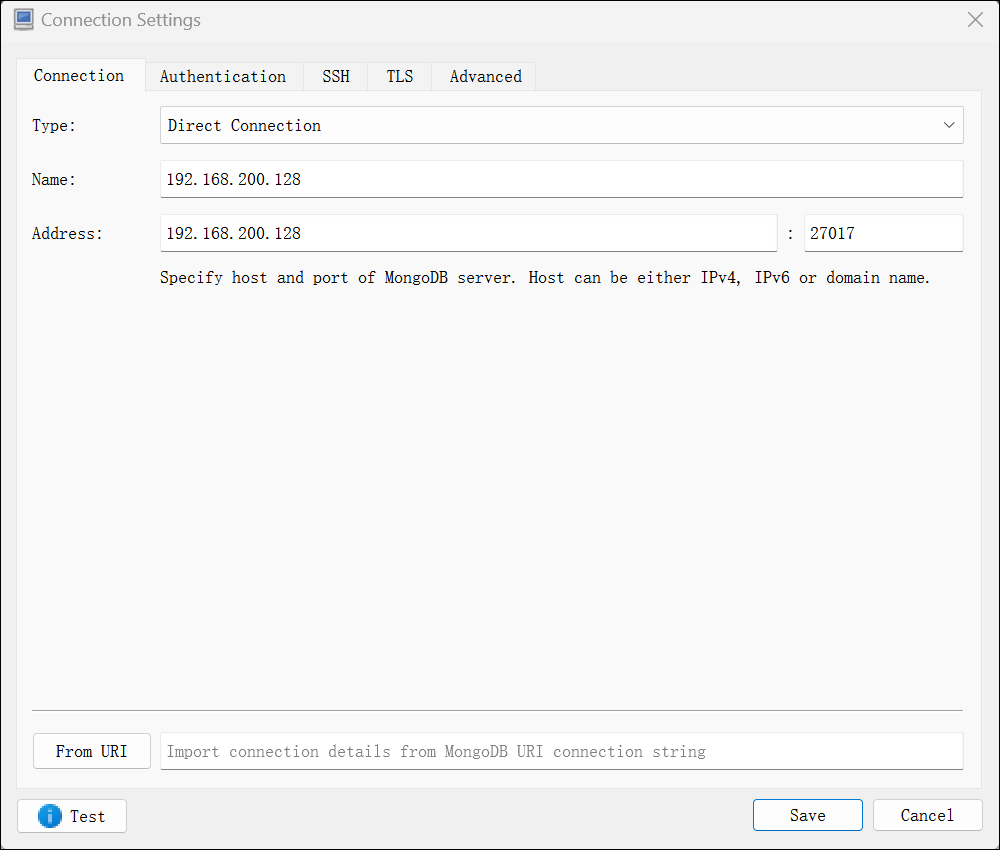
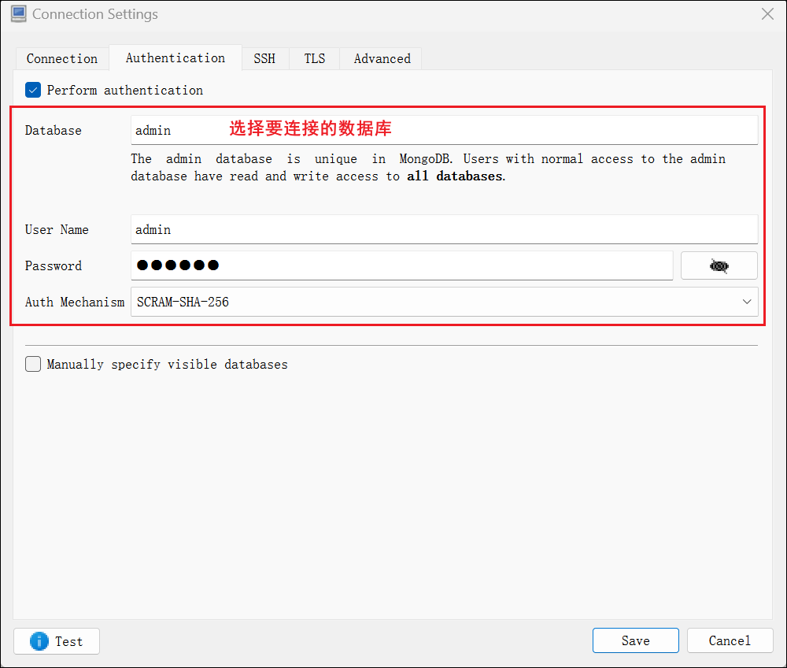
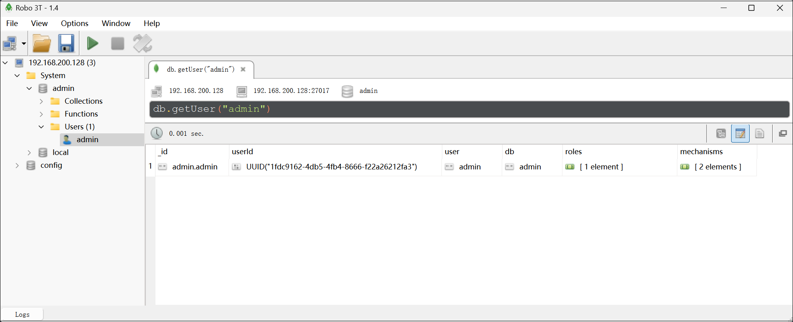

1、使用docker-compose运行mongodb容器
```shell
docker-compose -f dokcer-compse-mongodb.yml up -d
```
2、进入容器,连接mongo客户端
```shell
docker exec -it mongodb /bin/bash

# 进入mongo客户端
mongo
或者
mongo --port 27017 -u admin -p 123456
```
3、停止并删除容器
```shell
docker-compose dokcer-compse-mongodb.yml down
```
4、使用Robo3T连接测试






